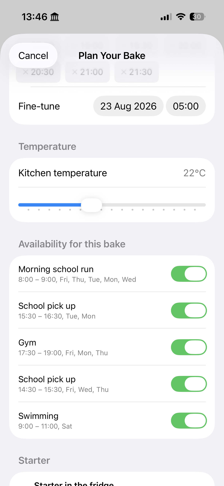
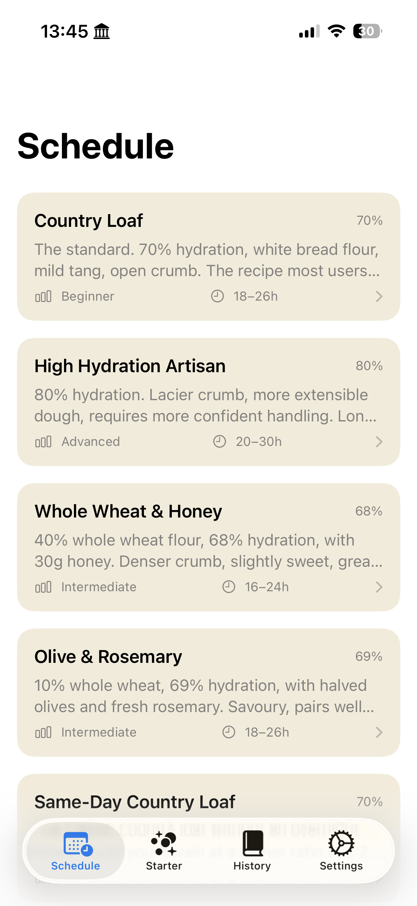
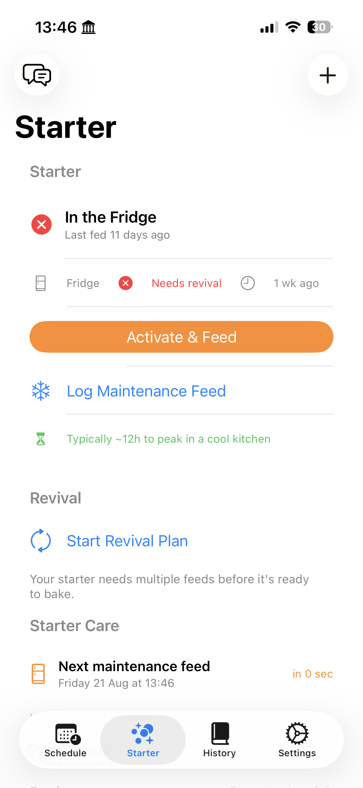

# Doug

Doug is a native iOS baking companion for planning and adapting sourdough bread bakes around real life.

Instead of treating a recipe as a fixed timeline, Doug models the bake as a schedule with fermentation state, temperatures, starter/levain readiness, flexible steps, ingredient timing, and the baker's actual availability. An AI coach uses that structured state to give context-aware guidance during the bake.

## Why I built it

I started baking sourdough during lockdown and have kept at it ever since. I’ve used some very good baking apps along the way, but they tend to make the same assumption: that the baker is available whenever the recipe says they should be.

Real life does not work like that.

A stretch and fold might land during the school run. A meeting might overrun. Dinner plans change. The dough might ferment faster than expected. Most baking apps can tell you what should happen next, but they are much less useful when the human’s schedule changes.

Doug started as an attempt to solve that problem. Instead of treating a bake as a fixed sequence of timers, it models the process alongside the baker’s availability and adapts the schedule when reality changes.

## Product

### Plan around real life

Doug combines the target bake time, kitchen temperature, and the baker's unavailable windows before building the schedule.

<p align="center">
  
</p>

### Choose the bake

Recipes carry their own hydration, method, difficulty, and timing rules into the scheduler.

<p align="center">
  
</p>

### Keep the starter ready

Starter state, maintenance feeds, and revival plans are tracked as part of the same baking system rather than as a separate timer.

<p align="center">
  
</p>

## What it models

The native app includes domain logic for:

- target-time scheduling across multi-stage bakes
- levain build/peak timing and starter state
- temperature-aware fermentation
- accumulated degree-hours during bulk fermentation
- live extrapolation beyond the last logged temperature reading
- recipe hydration and flour composition
- ingredient incorporation timing such as mix, fold, or topping stages
- flexible/passive steps such as cold retard
- cascading schedule changes when steps finish early or late
- unavailable windows in the baker's day
- water-temperature recommendations
- persistent bake state and live activity updates

Timing, temperatures, durations, ingredient quantities, and schedule state are calculated in code. The coach receives those facts as context and is used for explanation, prioritisation, and contextual guidance.

## AI coach

`doug-coach/` is a small TypeScript backend built with the Vercel AI SDK and AI Gateway.

It:

- validates the iOS payload with Zod
- builds context from the current bake, starter, and availability state
- streams coaching responses back to the app over SSE
- exposes constrained tools/actions to the model
- can protect the endpoint with an optional bearer token

The coach currently routes through Vercel AI Gateway to Gemini.

## Architecture

```text
Native iOS app
    │
    ├── recipe + fermentation domain model
    ├── schedule builder / adjustment logic
    ├── persistent bake state
    ├── temperature + degree-hour calculations
    │
    └── structured bake context
             │
             ▼
       Doug Coach API
       (TypeScript + Zod)
             │
             ▼
      Vercel AI Gateway
             │
             ▼
        AI baking coach
```

## Stack

### iOS

- Swift
- SwiftUI
- SwiftData
- Swift Testing
- Activity/live-state integrations

### Coach backend

- TypeScript
- Vercel AI SDK
- Vercel AI Gateway
- Zod
- Vercel Functions / Node

## Local coach development

```bash
cd doug-coach
npm install
cp .env.example .env
npm run dev
```

The development server exposes:

```text
POST http://localhost:3000/api/chat
```

Environment variables are documented in [`doug-coach/.env.example`](doug-coach/.env.example).

## Configuration

Local Xcode user data, environment files, and `Secrets.xcconfig` are kept out of source control. Running the coach requires your own AI Gateway credentials and, if enabled, a coach API token.
